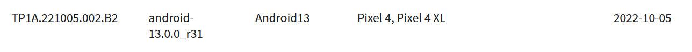
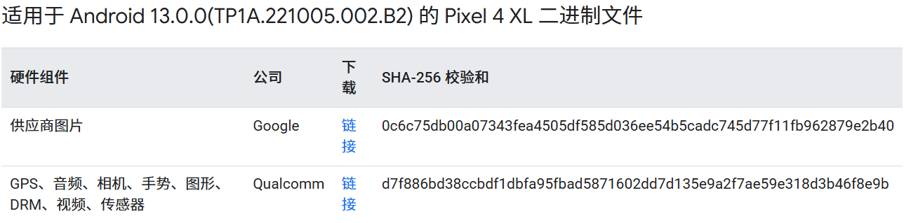
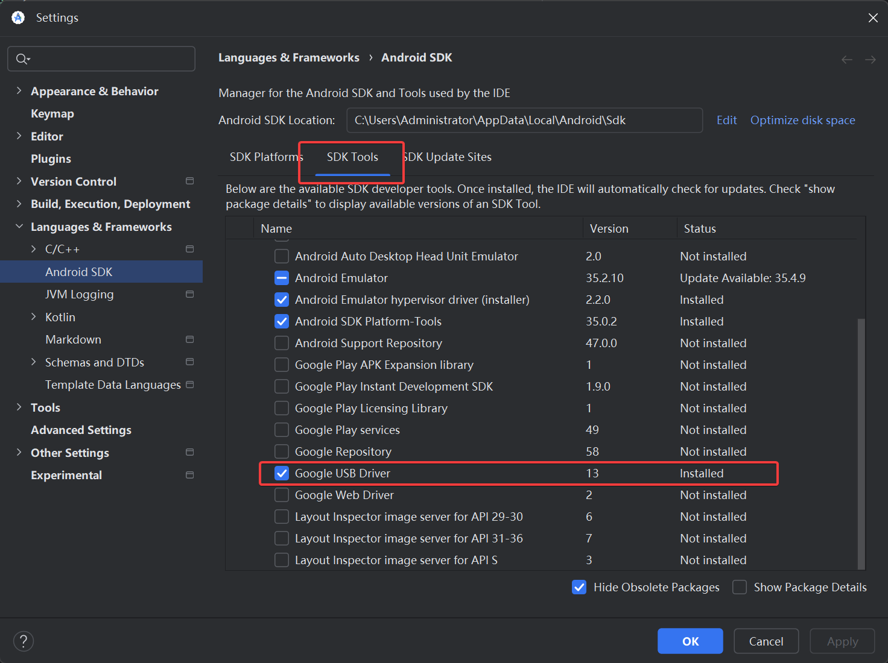
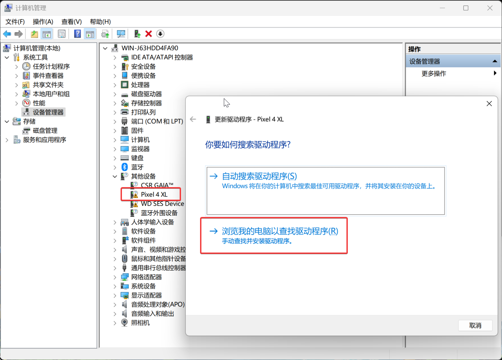
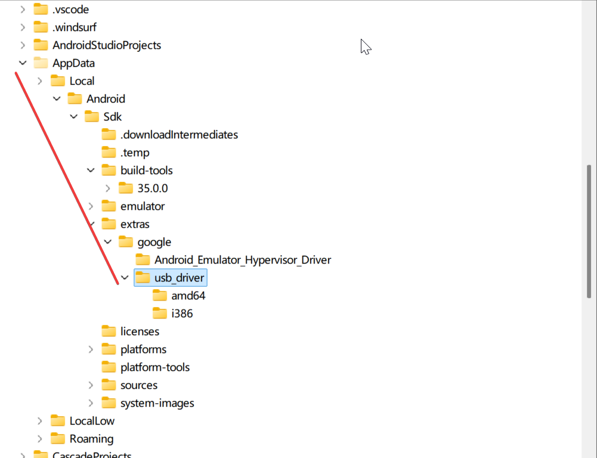

# WSL2编译AOSP

## WSL2 子系统的备份和还原
**查看当前WSL版本**
`wsl -l`
```powershell
PS C:\Users\Administrator> wsl -l
适用于 Linux 的 Windows 子系统分发:
Ubuntu (默认)
```
`wsl --version`
```powershell
PS C:\Users\Administrator> wsl --versio
命令行参数“--versio”无效
请使用 'wsl.exe --help' 获取受支持的参数列表。
PS C:\Users\Administrator> wsl --version
WSL 版本： 2.4.12.0
内核版本： 5.15.167.4-1
WSLg 版本： 1.0.65
MSRDC 版本： 1.2.5716
Direct3D 版本： 1.611.1-81528511
DXCore 版本： 10.0.26100.1-240331-1435.ge-release
Windows 版本： 10.0.26100.3476
```

**查看运行中的子系统**
`wsl -l --running`

```powershell
PS C:\Users\Administrator> wsl -l --running
适用于 Linux 的 Windows 子系统分发:
Ubuntu (默认)
```

**运行子系统**
`wsl --distribution Ubuntu`

**停止子系统**
`wsl --terminate Ubuntu` 或 `wsl --shutdown` (停止当前子系统)

```powershell
PS C:\Users\Administrator> wsl --terminate Ubuntu
操作成功完成。
```

**备份子系统（需要先停止才能备份）**
`wsl --export Ubuntu D:\WSL\Ubuntu.tar`
```powershell
PS C:\Users\Administrator> wsl --export Ubuntu D:\WSL\Ubuntu.tar
正在导出，这可能需要几分钟时间。 (3649 MB)

操作成功完成。
```

**卸载子系统**
`wsl --unregister Ubuntu-22.04`

**还原子系统**
`wsl --import <Distro> <InstallLocation> <FileName> [Options]`
`wsl --import Ubuntu D:\WSL D:\WSL\Ubuntu.tar`

**Note: 当还原后的子系统变为root权限了**
改为默认用户权限
1. 查看当前用户 `ls /home/`
2. 尝试切换至用户权限 `su 用户名`
3. 切换至[root权限](https://so.csdn.net/so/search?q=root%E6%9D%83%E9%99%90&spm=1001.2101.3001.7020) `sudo su`
4. 修改默认配置文件
	1. 备份 `cp /etc/wsl.conf /etc/wsl.conf.bk`
	2. 修改 `vim /etc/wsl.conf` 在最前面增加以下内容
	3. ```none
        [user]
        default=用户名 
        ``` 
 5. 重启wsl，在power shell中重启


## AOSP源码下载与同步
国内网络环境，可以优先考虑使用国内的镜像源，这里我使用的是中科大的镜像源：
> [AOSP - USTC Mirror Help](https://mirrors.ustc.edu.cn/help/aosp.html)

要查看指定产物应该切到哪个分支，可以在这里看：[Codenames, tags, and build numbers  |  Android Open Source Project](https://source.android.com/docs/setup/reference/build-numbers#source-code-tags-and-builds)

这里以Pixel 4XL 编译 Android 13 版本为例，


之后切到指定分支，同步代码即可。

## Android系统编译
### 驱动程序下载
在开始编译之前，需要先把设备相关的驱动程序二进制文件下载到代码仓库中，下载地址在：
[Nexus 和 Pixel 设备的驱动程序二进制文件  |  Google Play services  |  Google for Developers](https://developers.google.com/android/drivers?hl=zh-cn#coraltp1a.221005.002.b2)

将对应的二进制文件压缩包下载到AOSP仓库根目录之后，使用tar命令解压缩：
```shell
tar zxvf qcom-coral-tp1a.221005.002.b2-38f89b47.tgz
tar zxvf google_devices-coral-tp1a.221005.002.b2-71cf297a.tgz
```
解压完成之后，得到的是两个shell脚本，我们需要依次执行，然后会展示一段授权声明：
```shell
./extract-google_devices-coral.sh
./extract-qcom-coral.sh
```
查看完协议后，需要输入I ACCEPT才会将对应的驱动程序导入工程，如果之前编译过AOSP，一定要先清楚之前的编译缓存，进行全量重新编译，否则可能导致最后编出来的系统变砖。
```shell
m clean
```
### 开始编译
```
source build/envsetup.sh
```

lunch命令查看编译产物：
```shell
aaron@WIN-J63HDD4FA90:~/aosp/aosp$ lunch

You're building on Linux

Lunch menu .. Here are the common combinations:
     1. aosp_arm-eng
     2. aosp_arm64-eng
     3. aosp_barbet-userdebug
     4. aosp_bluejay-userdebug
     5. aosp_bramble-userdebug
     6. aosp_bramble_car-userdebug
     7. aosp_car_arm-userdebug
     8. aosp_car_arm64-userdebug
     9. aosp_car_x86-userdebug


Which would you like? [aosp_arm-eng]
Pick from common choices above (e.g. 13) or specify your own (e.g. aosp_barbet-eng):
```
输入对应的产物编号即可，


开始编译命令：
```
m -j28
```
，其中 -jN N就是指定并行构建的线程数，这里可以根据实际需要来调整并行构建的线程数，需要注意最好要比实际CPU的线程数少一些，否则可能导致编译失败。

报错信息解决：

第一个报错：
```shell
[  1% 1253/120333] bc: libclcore_debug.bc <= frameworks/rs/driver/runtime/rs_f16_math.c
FAILED: out/target/product/generic/obj/RENDERSCRIPT_BITCODE/libclcore_debug.bc_intermediates/rs_f16_math.bc
/bin/bash -c "PWD=/proc/self/cwd prebuilts/clang/host/linux-x86/clang-3289846/bin/clang -Iframeworks/rs/script_api/include -Iexternal/clang/lib/Headers -MD -DRS_VERSION=24 -std=c99 -c -O3 -fno-builtin -emit-llvm -target renderscript32-linux-androideabi -fsigned-char  -Wno-deprecated -Werror  -Werror -Wall -Wextra -Iframeworks/rs/cpu_ref -DRS_DECLARE_EXPIRED_APIS  -x renderscript -DRS_DEBUG_RUNTIME frameworks/rs/driver/runtime/rs_f16_math.c -o out/target/product/generic/obj/RENDERSCRIPT_BITCODE/libclcore_debug.bc_intermediates/rs_f16_math.bc"
prebuilts/clang/host/linux-x86/clang-3289846/bin/clang.real: error while loading shared libraries: libncurses.so.5: cannot open shared object file: No such file or directory
22:38:23 ninja failed with: exit status 1
```
提示找不到libncurses.so，我们直接搜索引擎关键字：AOSP libncurses.so.5 ，相关检索内容告诉我们要执行：
```shell
sudo apt-get install libncurses5
```
执行发现报错：
```shell
aaron@WIN-J63HDD4FA90:~/aosp/aosp$ sudo apt-get install libncurses5
Reading package lists... Done
Building dependency tree... Done
Reading state information... Done
E: Unable to locate package libncurses5
```
继续搜索引擎检索E: Unable to locate package libncurses5，执行：
```shell
sudo dpkg --add-architecture i386
sudo apt-get update
```
还是报错，继续检索解决方案：[apt - Failed to download libncurses5 - Ask Ubuntu](https://askubuntu.com/questions/1367038/failed-to-download-libncurses5)
> So you are running 64-bit Ubuntu 20.04 LTS. You can restore default APT repositories using the following single long command:

```bash
cat <<EOF | sudo tee /etc/apt/sources.list
deb http://archive.ubuntu.com/ubuntu/ focal main universe multiverse restricted
deb http://security.ubuntu.com/ubuntu/ focal-security main universe multiverse restricted
deb http://archive.ubuntu.com/ubuntu/ focal-updates main universe multiverse restricted
deb http://archive.ubuntu.com/ubuntu/ focal-backports main universe multiverse restricted

deb-src http://archive.ubuntu.com/ubuntu/ focal main universe multiverse restricted
deb-src http://security.ubuntu.com/ubuntu/ focal-security main universe multiverse restricted
deb-src http://archive.ubuntu.com/ubuntu/ focal-updates main universe multiverse restricted
deb-src http://archive.ubuntu.com/ubuntu/ focal-backports main universe multiverse restricted
EOF
```

add 32-bit i386 architecture, update package lists using and install needed packages

```bash
sudo dpkg --add-architecture i386
sudo apt-get update
sudo apt-get install libncurses5 libncurses5:i386
```
成功安装上libncurses5依赖，继续编译，这次编译到了38%，报错了：
```shell
[ 38% 45534/119097] //external/guice:guice_munge_manifest generate guice_munge.manifest                                                     FAILED: out/soong/.intermediates/external/guice/guice_munge_manifest/gen/guice_munge.manifest
out/host/linux-x86/bin/sbox --sandbox-path out/soong/.temp --output-dir out/soong/.intermediates/external/guice/guice_munge_manifest/gen --manifest out/soong/.intermediates/external/guice/guice_munge_manifest/genrule.sbox.textproto
The failing command was run inside an sbox sandbox in temporary directory
out/soong/.temp/sbox/b92ec391e4c00951c81c6c44c28224e29b6bace0
The failing command line can be found in
out/soong/.temp/sbox/b92ec391e4c00951c81c6c44c28224e29b6bace0/sbox_command.0.bash
out/soong/.temp/sbox/b92ec391e4c00951c81c6c44c28224e29b6bace0/sbox_command.0.bash: line 1: unzip: command not found
exit status 127
[ 38% 45537/119097] //frameworks/base:framework-cppstream-protos generate 2                                                                 frameworks/base/core/proto/android/os/batteryusagestats.proto:22:1: warning: Import frameworks/proto_logging/stats/enums/os/enums.proto but not used.
22:59:47 ninja failed with: exit status 1  
```
仔细看报错信息，有一个unzip: command not found，然后试了一下，系统里边确实没有unzip，安装一下：
```shell
sudo apt-get install unzip
```
继续编译，又报错zip命令没找到，安装完继续编译


## 刷机到Pixel 4XL
WSL中确认有adb和fastboot工具：
```shell
aaron@WIN-J63HDD4FA90:~/aosp/aosp$ adb --version
Android Debug Bridge version 1.0.41
Version 33.0.1-eng.aaron.20250315.223749
Installed as /home/aaron/aosp/aosp/out/host/linux-x86/bin/adb
aaron@WIN-J63HDD4FA90:~/aosp/aosp$ fastboot --version
fastboot version 33.0.1-eng.aaron.20250315.223749
Installed as /home/aaron/aosp/aosp/out/host/linux-x86/bin/fastboot
```

WSL2中执行 adb devices会报错：
```shell
aaron@WIN-J63HDD4FA90:~/aosp/aosp$ adb devices
* daemon not running; starting now at tcp:5037
* daemon started successfully
List of devices attached
* daemon still not running
error: cannot connect to daemon at tcp:5037: Connection refused
```
首先在宿主Windows主机上执行：
```bash
adb tcpip 5037
```
之后WSL中语气就能够找到对应设备了
```shell
aaron@WIN-J63HDD4FA90:~/aosp/aosp$ adb devices
List of devices attached
9C241FFBA001DW  device
```
我们使用fastboot进行刷机，首先进入fastboot模式：
```shell
adb reboot bootloader
```
之后手机就会重启进入fastboot模式，再进行刷写，发现会卡住：
```shell
aaron@WIN-J63HDD4FA90:~/aosp/aosp$ fastboot flashall -w
< waiting for any device >
```
这是因为Windows上没有相关USB驱动，我们先在Android-Studio中安装驱动：



点击确定之后，系统会自动从这下面查找可用驱动，进行安装就行，安装完成重新插入一下设备就行了。

在尝试了数次直接在WSL中使用fastboot命令或者将Ubuntu子系统的fastboot link到windows的fastboot.exe执行都没有效果之后，
> PS：这里其实 link 完后，wsl2 使用 fastboot.exe 刷机是能生效的，只是一开始编译的镜像有问题导致刷机后无法进入系统。


最终还是决定，回到windows的powershell终端中进行刷机，再进入fastboot模式后，powershell中：
```bash
PS C:\Users\Administrator> fastboot devices
9C241FFBA001DW   fastboot
```
可以看到设备连接到了fastboot，接下来我们进行环境变量的配置，这一步是在windows的系统环境变量中进行设置，我们在Path路径中增加一个叫ANDROID_PRODUCT_OUT的环境变量，其内容就是编译出来的产物的 product 路径。之后再在 power shell 中通过win 下面的 fastboot 命令行工具完成刷机即可。

建议：
编译中途出现任何失败，都先解决报错之后再完整重新编译。
参考：
[How To Guide - Build AOSP for Pixel 9 Pro / 9 Pro XL | XDA Forums](https://xdaforums.com/t/build-aosp-for-pixel-9-pro-9-pro-xl.4715103/)