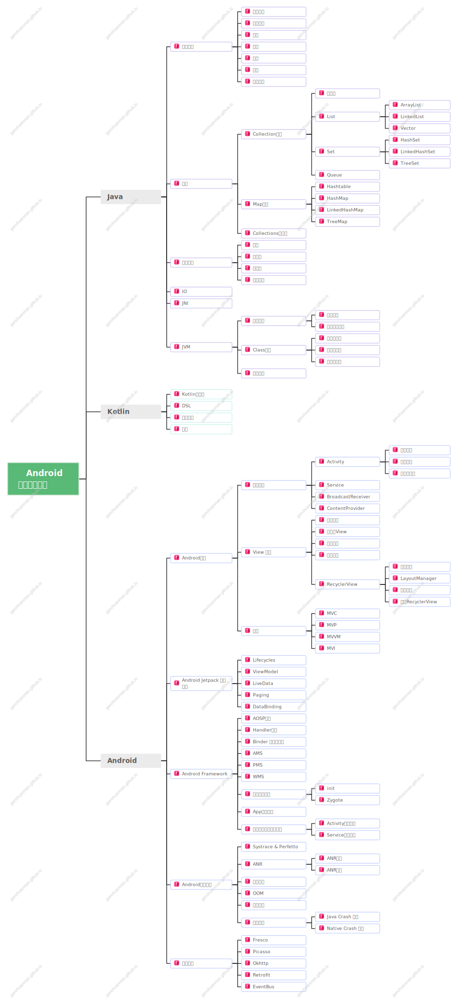

# Android开发知识体系
## 缘起
在经过了大概小一个月的 [**找工作的历程**](/docs/life/关于找工作的一些感想/) 后，回顾过去一个月中大概小 30 场的面试，我意识到了一个问题，社招场景下的面试，大概是围绕以下几个部分去进行的：
- **项目经历**：这个没什么好说的，个人有个人的项目经历。
- **专业技能**：俗称“八股文”。
- **软素质**：工作的方式方法，思维方式，抗压能力，个人成长历程...

其中专业技能占比并不低，尤其是在一二面中，相当部分的内容都是围绕这种所谓的“八股文”展开的，如果能够把这些碎片化的点，体系化的总结出来，无疑对今后的职业发展是有益的，毕竟体系化的总结往往能够带来高效率的复习，今后如果再去面试，涉及到的这些碎片化知识点能够很快的被捡起来，能够更快更全面的进入面试状态，从而提升自己在就业市场的竞争力。

于是萌生了一个以知识树的方式去构建一个 Android（可能之后还会有大前端？） 开发者的知识库，这个知识库不是零碎的八股文总结，而是通过树状的思维导图的方式来组织整个知识库。

## 知识体系
导图如下：
> - ❗️为待整理，可以先 [star](https://github.com/ganchuanman/ganchuanman.github.io) 收藏一下～
> 
> - ✅为整理完成，可以在左侧相应的目录树下面看到整理的内容。
> > 思维导图使用 [亿图脑图 MindMaster](https://www.edrawsoft.cn/viral-marketing/Invited.html?s_uid=22112428&pro_t=mind) 绘制，如果本站点的内容对你有帮助且你也刚好需要一款不错的思维导图管理软件，那不妨顺带让我[赚点佣金](https://www.edrawsoft.cn/viral-marketing/Invited.html?s_uid=22112428&pro_t=mind)吧，🫶。

